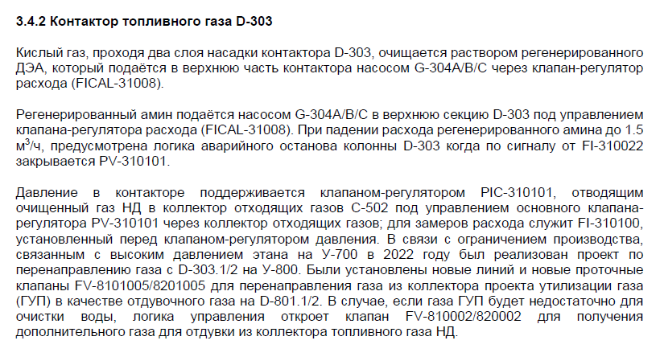
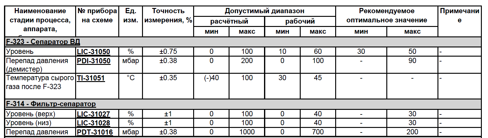
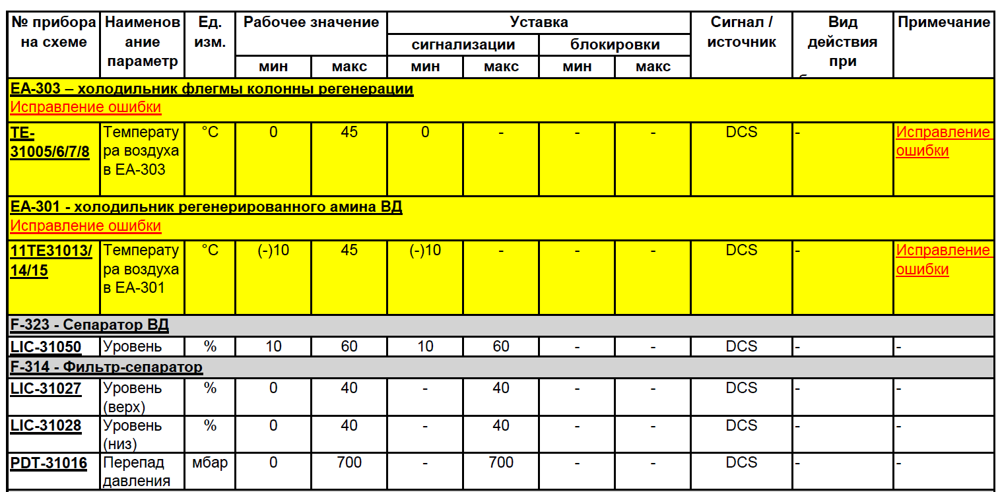
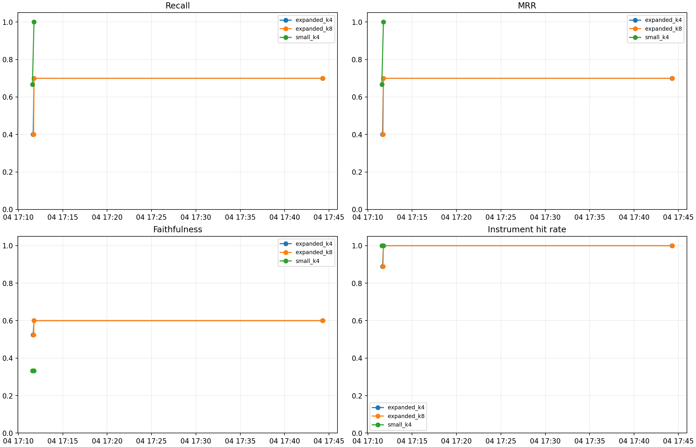

# RAG-agent

RAG-агент для технической документации установки У-300 КТЛ-1.

Проект отвечает на вопросы по производственным документам (регламент, нормы, аварийные/сигнальные карты), используя:

- векторный поиск по извлеченному тексту,
- rerank для повышения релевантности,
- структурированные таблицы по приборам/уставкам,
- LLM для финальной формулировки ответа с цитатами.


## О проекте и документах

Агент предназначен для инженеров/технологов, которым нужно быстро получить ответ вида:

- какие уставки по конкретному прибору;
- какие действия при конкретной сигнализации/блокировке;
- где в регламенте описан нужный процесс или продукт.

Обычно в контуре используются 3 типа документов:

1. Технологический регламент (процесс, описание установки, продукты, режимы).
2. Нормы технологического режима (уставки, диапазоны, единицы измерения).
3. Аварии и сигнализации (условия срабатывания, действия, примечания).

## Примеры фрагментов документов (PNG)

Ниже приведены примеры фрагментов основных документов, с которыми работает агент.

### 1) Технологический регламент



---

### 2) Нормы технологического режима



---

### 3) Аварии и сигнализации



## Что нужно для запуска

- Python 3.10+
- Файлы PDF в папке `data/`
- OpenAI API ключ (или совместимый endpoint)

## Быстрый старт

```bash
python -m venv .venv
.venv\Scripts\activate
pip install -r requirements.txt
```

```bash
# PowerShell
$env:OPENAI_API_KEY="your_api_key"
$env:OPENAI_MODEL="gpt-4o-mini"
# optional
# $env:OPENAI_BASE_URL="https://api.openai.com/v1"
```

```bash
python ingest.py --data_dir data --out_dir storage
streamlit run app.py
```

## Основные файлы

- `app.py` — интерфейс Streamlit
- `ingest.py` — индексация PDF в FAISS
- `rag_core.py` — поиск, rerank, генерация ответа
- `rag_structured.py` — работа с нормами и авариями
- `eval/eval_rag.py` — оценка качества

## Оценка качества

```bash
# с LLM
python eval/eval_rag.py --gold eval/gold_qa.jsonl --k 4

# без LLM (если API недоступен)
python eval/eval_rag.py --gold eval/gold_qa.jsonl --k 4 --no-llm
```

Смотреть метрики:

- `Recall@k`
- `MRR@k`
- `Faithfulness (proxy)`
- `Answer with citation rate`
- `Instrument hit rate`

## История метрик и графики

Теперь есть отдельный скрипт, который:

- сохраняет историю метрик в CSV,
- строит график изменения метрик во времени,
- формирует таблицы `latest` и `before/after`.

### Быстрый запуск трекера

```bash
# 1) Добавить ручной baseline (если нужно)
python eval/track_metrics.py add-manual \
	--label "before-change" \
	--notes "Базовый прогон" \
	--config expanded_k4 \
	--gold eval/gold_qa.jsonl \
	--k 4 --no-llm --n 40 \
	--recall 0.4 --mrr 0.4 --faithfulness 0.525 \
	--citation-rate 1.0 --instrument-hit-rate 0.8889

# 2) Снять текущий snapshot по дефолтным конфигам
python eval/track_metrics.py run \
	--label "after-change" \
	--notes "Описание изменений"

# 3) Пересобрать графики/таблицы из истории
python eval/track_metrics.py render
```

Артефакты:

- `eval/metrics_history.csv` — вся история запусков
- `eval/reports/metrics_history.png` — график метрик
- `eval/reports/latest_metrics.csv` — последние значения
- `eval/reports/before_after.csv` — сравнение первого и последнего прогона
- `eval/reports/metrics_report.md` — готовый отчёт

## Проблемы и шаги улучшения

Проблемы при реализации:

1. Сильный дисбаланс чанков по документам (регламент доминировал выдачу).
2. Ошибка в structured-lookup: поиск норм по прибору шёл не по полю тега.
3. Из-за этого запросы по уставкам часто не попадали в `Нормы`.
4. На длинных текстовых вопросах по регламенту в top-k часто попадал boilerplate-текст (заголовочные/повторяющиеся фрагменты), и LLM отвечала слишком общо.

Решения:

1. Добавил улучшения retrieval/rerank (intent signals, структурные кандидаты, балансировку).
2. Исправил корневую ошибку поиска в `find_norm_by_instrument` (поиск по `param` с нормализацией).
3. Добавил постоянный трекинг истории метрик и авто-графики.
4. Для длинного текста добавил query-focused контекст, дедупликацию повторяющихся чанков, штраф boilerplate-фрагментов, keyword-scan по регламенту и deterministic extract path для вопроса о продуктах установки (точный список с цитатой).

## Сравнение до/после

| Конфиг | Recall (до) | Recall (после) | MRR (до) | MRR (после) | Faithfulness (до) | Faithfulness (после) |
| --- | ---: | ---: | ---: | ---: | ---: | ---: |
| expanded_k4 (N=40) | 0.40 | 0.70 | 0.40 | 0.70 | 0.525 | 0.60 |
| expanded_k8 (N=40) | 0.40 | 0.70 | 0.40 | 0.70 | 0.525 | 0.60 |
| small_k4 (N=3) | 0.667 | 1.00 | 0.667 | 1.00 | 0.333 | 0.333 |

## Последний прогон с LLM (включен)

После настройки ключа и проверки LLM-конфига был выполнен полный прогон с включенной генерацией (не `--no-llm`).

| Конфиг | Recall | MRR | Faithfulness | Citation rate | Instrument hit rate | LLM errors |
| --- | ---: | ---: | ---: | ---: | ---: | ---: |
| expanded_k4 (N=40) | 0.70 | 0.70 | 0.60 | 1.00 | 1.00 | 0 |
| expanded_k8 (N=40) | 0.70 | 0.70 | 0.60 | 1.00 | 1.00 | 0 |

Вывод: LLM-слой работает стабильно (`LLM errors = 0`), а качество retrieval/ранжирования сохранилось на уровне предыдущих лучших прогонов.

Итоговые метрики по последнему прогону (`after-structured-lookup-fix`) смотри в:

- `eval/reports/latest_metrics.csv`
- `eval/reports/metrics_report.md`



## Примеры вопросов и ожидаемых ответов

Ниже примеры реальных вопросов для проверки RAG и что должно быть в хорошем ответе.

#### Пример 1 — Уставки по приборам
**Вопрос:** Какие рекомендуемые уставки LIC-31050 и PDT-31016?

**Ожидаемый ответ:**
- Упоминание обоих приборов (`LIC-31050`, `PDT-31016`).
- Значения/диапазоны и единицы измерения (`%`, `мбар`).
- Ссылка на `Нормы технологического режима У-300 КТЛ-1` (со страницей).

---

#### Пример 2 — Аварийные действия
**Вопрос:** Какие автоматические действия при падении общего расхода амина FT-310452?

**Ожидаемый ответ:**
- Конкретные действия блокировки (закрытие клапанов, перевод регуляторов в ручной режим, действие по факелу).
- Указание уставки и логики срабатывания.
- Ссылка на `Аварии и сигнализации У-300 КТЛ-1` (со страницей).

---

#### Пример 3 — Текстовый вопрос по регламенту
**Вопрос:** Что является продуктами установки 300?

**Ожидаемый ответ:**
- Перечень продуктов из регламента: очищенный газ ВД, очищенный газ СД, очищенный газ НД, кислый газ.
- Без выдуманных продуктов.
- Ссылка на `Технологический регламент У-300 КТЛ-1` (со страницей).

---

#### Пример 4 — Срабатывание сигнализации
**Вопрос:** Какие действия при срабатывании LT-31003?

**Ожидаемый ответ:**
- Уставка и конкретное действие (например, закрытие соответствующих клапанов).
- Примечание, если присутствует в документе.
- Ссылка на `Аварии и сигнализации`.

---

#### Пример 5 — Температурная уставка
**Вопрос:** Какие уставки для TIC-31016?

**Ожидаемый ответ:**
- Значение уставки/рабочего диапазона и единицы (`°C`).
- Привязка к оборудованию, если определяется по данным.
- Ссылка на `Нормы технологического режима`.

---

#### Пример 6 — Сигнализации по оборудованию
**Вопрос:** Какие сигнализации есть для F-301?

**Ожидаемый ответ:**
- Список сигнализаций по `F-301` с параметром, уставкой и действием при срабатывании.
- Без общего текста без деталей.
- Ссылки на соответствующие источники.

### Реальные ответы LLM (фактический прогон)

Ниже примеры фактических ответов (`gpt-4o-mini`) из `eval/reports/llm_real_examples.json`.

#### Кейc 1 — Уставки по приборам
**Вопрос:** Какие рекомендуемые уставки LIC-31050 и PDT-31016?

**Фрагмент ответа:**
- Для `LIC-31050` указана уставка 10% и рабочий диапазон 100.0–10.0.
- Для `PDT-31016` в этом прогоне модель сообщила про отсутствие данных.

**Цитаты:**
- Нормы технологического режима У-300 КТЛ-1.pdf, стр. 1
- Аварии и сигнализации У-300 КТЛ-1.pdf, стр. 1

**Latency:** ~6500 мс

---

#### Кейc 2 — Аварийные действия
**Вопрос:** Какие автоматические действия при падении общего расхода амина FT-310452?

**Фрагмент ответа:**
- Закрытие `UV-310300`, `UV-310301`.
- Перевод `FV-31001` и `FV-31002` в ручной режим и закрытие.
- Открытие клапана на факел `PV31005` на 20%.
- Снижение уставки `PIC31005` с 61.5 до 58.5 бар изб.

**Цитаты:**
- Аварии и сигнализации У-300 КТЛ-1.pdf, стр. 1
- Технологический регламент У-300 КТЛ-1.pdf, стр. 58

**Latency:** ~9400 мс

---

#### Кейc 3 — Текстовый вопрос по регламенту
**Вопрос:** Что является продуктами установки 300?

**Фрагмент ответа:**
- очищенный газ ВД (на У-700);
- очищенный газ СД (на У-200);
- очищенный газ НД (в коллектор отходящих газов / печь дожига);
- кислый газ с высоким содержанием H2S (на У-400).

**Цитаты:**
- Технологический регламент У-300 КТЛ-1.pdf, стр. 7

**Latency:** deterministic extract path (без отдельного LLM-вызова)

Примечание: реальные ответы LLM могут быть неполными на отдельных вопросах, поэтому для контроля качества используем и метрики, и ручной review ответов.

Минимальные критерии «правильного» ответа:

1. Есть точные теги приборов/оборудования из вопроса.
2. Есть числовые значения и единицы, если вопрос про уставки/нормы.
3. Есть действия при срабатывании, если вопрос про аварии.
4. Есть цитаты с документом и страницей.
5. Нет фактов, которых нет в документах.

## Примечание

Если нет `storage/faiss.index`, сначала запусти `ingest.py`.
